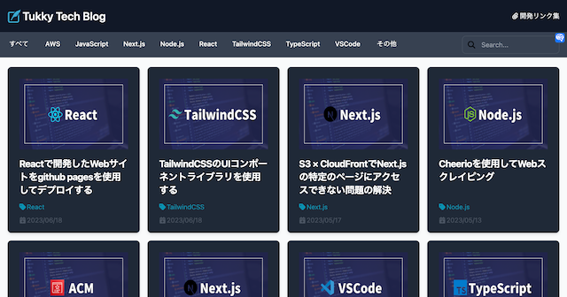

 

### デプロイ先

-   AWS S3 × CloudFront  
    https://tukkytech.com

 

### 参考記事

-   [microCMS + Next.js で Jamstack ブログを作ってみよう](https://blog.microcms.io/microcms-next-jamstack-blog/)
-   [Jamstack って何なの？何がいいの？](https://qiita.com/ozaki25/items/4075d03278d1fb51cc37)
-   [Flowbite - Tailwind CSS component library](https://flowbite.com/docs/getting-started/introduction/)
-   [Font Awesome（アイコン検索）](https://fontawesome.com/icons)
